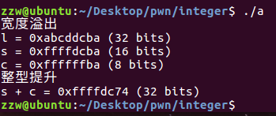

## 1. 整数溢出是什么
计算机的整数分为有符号和无符号。整数在内存中保存在一个固定长度的空间内，其能表示的最大值和最小值是固定的，也就是有一定范围的。当某种类型的值超出这个[最小值，最大值的范围]，就会导致整数溢出。

32位整数
|数据类型|最小值(范围)|最大值(范围)|
|--|--|--|
|[signed] char|-128|127|
|unsigned char|0|255|
|[signed] short int|-32768~-1(0x8000~0xffff)|0~32767(0~0x7fff)|
|unsigned short int|0|65535(0~0xffff)|
|[signed] int|-2147483648~-1(0x80000000~0xffffffff)|0~2147483647(0~0x7fffffff)|
|unsigned int|0|4294967295(0xffffffff)|
|[signed] long|-2147483648~-1(0x80000000~0xffffffff)|0~2147483647(0~0x7fffffff)|
|unsigned signed long|0|4294967295(0xffffffff)|
||||


64整数
|数据类型|最小值(范围)|最大值(范围)|
|--|--|--|
|[signed] char|-128|127|
|unsigned char|0|255|
|[signed] short int|-32768~-1(0x8000~0xffff)|0~32767(0~0x7fff)|
|unsigned short int|0|65535(0~0xffff)|
|[signed] int|-2147483648~-1(0x80000000~0xffffffff)|0~2147483647(0~0x7fffffff)|
|unsigned int|0|4294967295(0xffffffff)|
|[signed] long| 0x8000000000000000~0xffffffffffffffff|0~0x7fffffffffffffff|
|unsigned long|0|0~0x7fffffffffffffff|
||||


要注意的是long类型，在linux64下是8个字节。
总结来说：当程序中的变量数据超过其数据类型的范围，则会造成溢出，整数类型的溢出被称为整数溢出。
## 2 整数的计算机表示
### 2.1 基础知识
计算机中，整数的长度是确定的。比如字长32位的计算机中，整数的长度就是32个二进制。其中包括了符号位（首位为1 时，表示该数为负值，为0时表示为正值）。


int类型-1的打印值为0xffffffff,最大值0x7fffffff。从首位看，感觉表示上-1的表示值比int的最大值还要大。因为看上去“折半”了。

在计算机中，所有的数据最终都是使用二进制数表达。
对无符号数来说，所有的位都用于表示该值的大小。（很好理解都是正数）
对有符号数来说，首位要表示符号，其余才是值。数学中，负数在最前面都会加上‘-’符号来表示。在计算机硬件上，数字上都以无符号的二进制来表示。但是负数如何用二进制表示？
答案就是通过，原码，反码，补码，扩展二进制数字系统，来表示有符号数。
在计算机内部，就是用补码表示有符号数。


计算机没有减法，只做加法，所以才弄了个补码出来。为什么不做减法呢，减法需要借位，比较麻烦，所以只做加法就好了

### 2.3 原码/反码/补码
正数（无符号数）的原码，反码和补码一样。
**原码**
正数的原码还是其本身。
原码就是符号位加上该值的绝对值。即第一位是符号位，其余表示值
如： 1的绝对值表示 0000 0001
              +
           符号位 1
     -1的原码     1000 0001

**反码**

正数的反码还是其本身。
负数的反码就是在其原码的基础上，符号位不变，其余各位取反。

还是-1为例：
    1的反码还是1
    -1的反码则是 1111 1110

**补码**

正数的补码还是其本身。
负数的补码就是在反码的基础上，最后+1。

1的补码还是1
        -1的反码为              1 111 1110
                                    +1
                                1 111 1111
总结来说：如char a =-1
   1.先取-1的原码： 1000 0001
   2.除符号位外取反，得反码：1111 1110
   3.加1得补码： 1111 1111


### 2.1 无符号数

|字节数|十进制值|二进制值|
|--|--|--|
|单字节|255| 1111 1111 |   
|双字节数|65535| 1111 1111 1111 1111|
||||
255 = 128+64+32+16+8+4+2+1 

65535 = 32768 + 16384 +8192 + 4096 + 2048 + 1024 + 512 + 256 + 255 

### 2.2 有符号数

有符号数中最高位用于表示正负。为1 时，表示该数为负值，为0时表示为正值。
以单字节整数为例：
signed char  a = 255
对于常见的四字节.
-1的二进制表示是：
原码 1000 0000 0000 0000 0000 0000 0000 0001
反码 1111 1111 1111 1111 1111 1111 1111 1110
补码 1111 1111 1111 1111 1111 1111 1111 1111
表示  f    f    f    f    f    f    f    f

## 3.整数溢出的类型及表现
整数的异常情况主要有三种：
1. 溢出
   只有有符号数才会溢出。当有符号数的运算结果不能用结果类型表示时就会发生溢出。可以分为上溢出和下溢出。
   

   **上溢出**
    最大值加1后变为最小值

   

   **下溢出**
   最小值减1后变为最大值
   

2. 回绕
   无符号数会回绕。常绕过一些判断语句。他不会溢出，只会循环的绕圈。
   
   
   
   整体来看，无符号数的最小值为0，最大值根据符号来定。即永远不会得到比0小的值。

3. 截断
   截断通俗理解就是大长度的数据保存在小长度的数据中，高处的二进制位会被抛弃，只保留小长度数据可以保存的低位。

   **加法截断**
```
0xffffffff + 0x00000001
= 0x0000000100000000 (long long)
= 0x00000000 (long)
```
**乘法截断**
```
0x00123456 * 0x00654321
= 0x000007336BF94116 (long long)
= 0x6BF94116 (long)
```
这种截断场景常见于赋值，类型强制转换。可能是显式（类型申明转换）或者隐式（算术运算得到）。如果小宽度的数据类型向一种具有更大宽度的类型转换，通常会保留数学值。但如果大宽度转小宽度，则会导致高位丢失。

在整数转换过程中，可能会导致如下错误：

- 损失值，大宽度转小宽度
- 损失符号，有符号类型转无符号类型

在数据计算时，还要注意一个隐藏的知识点：在不同类型数据计算时，较小宽度的操作数会被提升到较大宽度的类型，再进行计算。这种潜在的整数类型提升也可能会导致问题。
```
#include<stdio.h>
void main() {
    int l;  
    short s;
    char c;

    l = 0xabcddcba;
    s = l;
    c = l;

    printf("宽度溢出\n");
    printf("l = 0x%x (%d bits)\n", l, sizeof(l) * 8);
    printf("s = 0x%x (%d bits)\n", s, sizeof(s) * 8);
    printf("c = 0x%x (%d bits)\n", c, sizeof(c) * 8);

    printf("整型提升\n");
    printf("s + c = 0x%x (%d bits)\n", s+c, sizeof(s+c) * 8);
}
```
 
## 4. 整数溢出场景
**危害**

整数溢出除了改写数据类型的大小外，没有直接修改内存，不会直接导致任意代码执行。但如果这个整数用来计算一些敏感数据，如作为缓冲区的大小或者数值索引，就会产品潜在危险（堆栈溢出等）。

**size_t类型**
它是一个与机器相关的unsigned类型，其大小足以保证存储内存中对象的大小。其实就可以理解为是无符号整数类型的sizeof()的结果。常被误用导致整数溢出。
```
#include<string.h>
void *memcpy(void *dest, const void *src, size_t n)
```
memcpy函数将src所指向的字符串以src地址开始的n个字节复制到dest所指向的数组中，并返回dest。
```
#include <string.h>
char *strncpy(char *dest, const char *src, size_t n);
```
strncpy() 函数从源 src 所指的内存地址的起始位置开始复制 n 个字节到目标 dest 所指的内存地址的起始位置中。
```
#include <unistd.h>    
ssize_t read(int fd, void *buf, size_t count);  
```
read函数从打开的设备或者文件中读取n个字符到buff缓冲区中
### 4.1 示例1 类型转换
```
#include<stdio.h>
int main(void)
{
    int len, l;
    char buf[11];

    scanf("%d", &len);
    if (len < 10) {
        l = read(0, buf, len);
        *(buf+l) = 0;
        puts(buf);
    } else
        printf("len is >10");        
}
```

len是有符号类型，所以len的长度可是是一个负数，这样就绕过了长度检测的限制。由于read的第三个类型是size_t，负数会被转为一个无符号的整形。于是变成了一个很大的整数，从而复制大量的内容到buf，导致缓冲区溢出。
### 4.2 示例2 回绕
```
#include<stdio.h>
#include<stdlib.h>
int main(void)
{
    setbuf(stdout,NULL);
    unsigned int len;
    char *buf;
    scanf("%d", &len);
    printf("len+5 = %d\n",len+5);
    buf = malloc(len+5);
    if(buf)
    {
     printf("malloc is ok!!!\n");
    } 
    read(0, buf, len);
    puts(buf);
    free(buf);      
    return 0;
}
```

len为无符号整型的最大值，随便加个数就会回绕到小数。这样申请的缓冲区也小，输入数据后就会导致溢出。


## 5 整数溢出的检测与防御
如何避免有符号数溢出？
（1）进行有符号整数操作时，需对有符号整数的取值范围进行有效判断
（2）进行来自不可信的有符号整数进行运算操作时，需要注意
（3）使用原地阿妈静态分析工具进行检测。
如何避免无符号整数回绕？

（1）当函数的参数类型为无符号整数时，需要对传入的参数的值进行有效判断，避免直接或者经过运算后产生回绕；

（2）不可信源的数据仍旧需要格外注意，应对来自不可信源的数据进行过滤和限制；

（3）使用源代码静态分析工具进行自动化的检测，可以有效的发现源代码中的无符号整数回绕问题。

